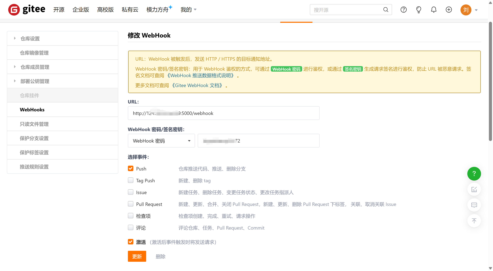
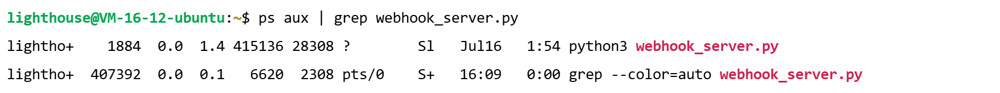
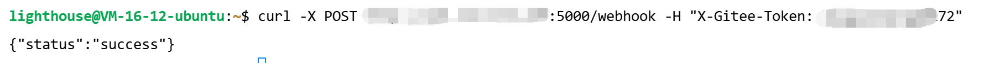
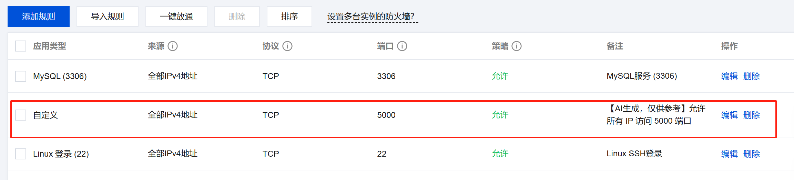

## 1.配置gitee仓库

进入到gitee仓库中要部署的项目，点击管理，配置你服务器的地址, 并且设置一个webhook密码，也可以不设置密码，
但是为了安全起见，尽量设置一个，防止代码泄露的风险

```aiignore
url = ip + 端口号 + /webhook
```


选择事件Push， 勾选下边的激活，表示你每次推送代码到远程仓库都会触发这个请求，然后点击添加保存即可

## 2.服务器接收这个hook

现在你每次推送代码都会触发这个请求了，服务器得接收这个请求吧，这里需要写一个接收的方法

实现的思路是通过python接收这个请求，接收到之后触发一个脚本拉取仓库代码，并且复制到你的web服务器

在你的服务器用户下的文件夹新建一个`webhook_server.py`的文件，编写如下代码：
```aiignore
from flask import Flask, request, jsonify
import subprocess

app = Flask(__name__)

SECRET_TOKEN = "***"  # 对应 Gitee 设置的密码

@app.route('/webhook', methods=['POST'])
def webhook():
    # 可选：校验 token
    if request.headers.get('X-Gitee-Token') != SECRET_TOKEN:
        return jsonify({"status": "unauthorized"}), 401

    print("Received push event, pulling and deploying...")

    # 执行部署脚本
    try:
        subprocess.run(["./deploy.sh"], check=True)
        return jsonify({"status": "success"})
    except Exception as e:
        print(e)
        return jsonify({"status": "error", "message": str(e)}), 500

if __name__ == '__main__':
    app.run(host='0.0.0.0', port=5000)

```
记得修改代码中你在gitee中设置的密码
运行这段代码需要你在服务器中有python环境，没有的可以安装一下
```aiignore
sudo apt-get install python3
```
安装成功后你的服务器就有python的包管理工具pip了，我们安装一下代码需要的依赖
```aiignore
pip install flask
```
然后我们就可以结合`nohup`运行这个代码了
```aiignore
nohup python3 webhook_server.py > webhook.log 2>&1 &
```
其中：
 - > webhook.log：输出日志到文件
 - 2>&1：错误也重定向到日志
 - &：后台运行
 - nohup：关闭终端也不中断
查看一下是否运行成功
```aiignore
ps aux | grep webhook_server.py
```
运行成功后终端会显示如下信息


## 3. 编写脚本自动拉取代码
在上边`webhook_server.py`代码中，请求成功后执行了一个`deploy.sh`脚本,这个脚本的作用就是拉取你的gitee仓库的代码，并把代码复制
到你的web服务器
请确保你的服务器有git工具，并且添加了ssh并配置到你的gitee，如果没有安装git，可以执行下边这个命令
```aiignore
sudo apt-get install git
```
然后新建一个文件夹`myProject`，并测试是否能够拉取成功
```aiignore
git clone git@gitee.com:drnm/drnm_site.git
```
如果你的是一个vue或者react项目，需要安装node环境
```aiignore
sudo apt-get install nodejs
```

一切工作准备就绪，就可以新建deploy.sh了,里边写如下代码
```aiignore
#!/bin/bash

# 进入项目目录
cd /home/lighthouse/myProject/drnm_site || exit

# 拉取最新代码
git reset --hard
git pull origin master

# 如果是vue等项目需要执行 npm i 和npm run build

# 复制构建后的文件到 Nginx 目录
cp -r ./* /var/www/html/

echo "Deployed successfully"
```
注意复制的路径要写对，如果你是vue项目可能是
```aiignore
cp -r ./build/* /var/www/html/
```

## 4.测试一下
我们借助curl请求一下webhook地址，并传入你设置的密码
```aiignore
curl -X POST webhook地址 -H "X-Gitee-Token: 密码
```
如果显示如下信息，证明你成功了


如果显示失败可能原因如下：
 - 你的服务器没有开通5000端口，去云服务器后台将这个端口添加到规则里，我的是腾讯云服务器，参考如下：
   
 - deploy.sh没有权限，执行如下代码添加权限
```aiignore
 chmod +x deploy.sh
```

最后你就可以修改网站代码，推送，查看你修改的内容是否更新